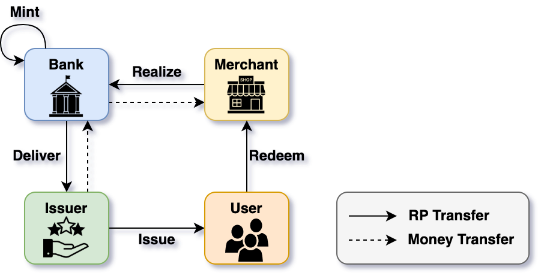
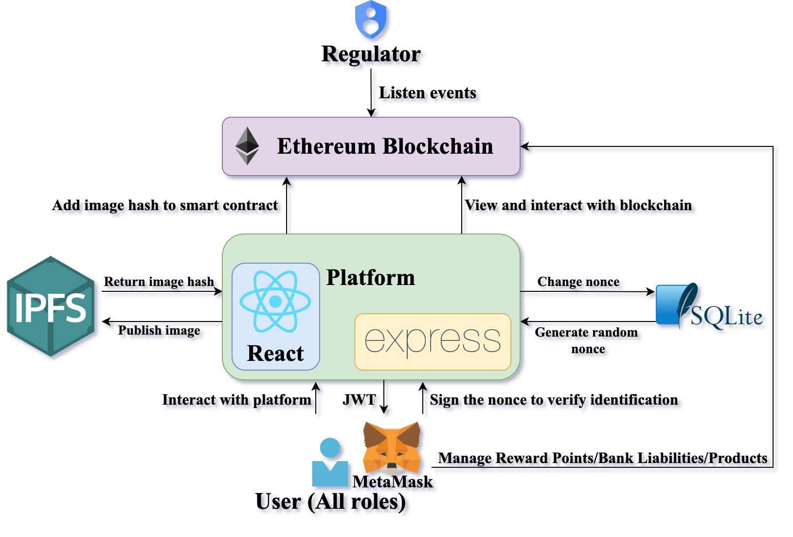
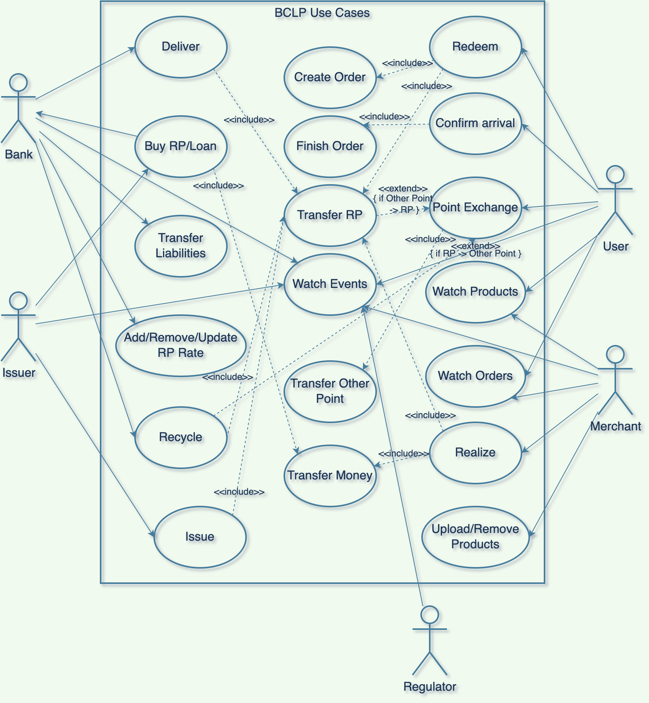

# BCLP
<br />
<p align="center">
  <p align="center">
    Blockchain-based Collaborative Loyalty Program for Business Consortium
    <br />
    <a href="https://github.com/HC-TW/BCLP/issues">Report Bug</a>
    ·
    <a href="https://github.com/HC-TW/BCLP/issues">Request Feature</a>
  </p>
</p>

<!-- TABLE OF CONTENTS -->
<details open="open">
  <summary>Table of Contents</summary>
  <ol>
    <li>
      <a href="#about-the-project">About The Project</a>
      <ul>
        <li><a href="#built-with">Built With</a></li>
      </ul>
    </li>
    <li>
      <a href="#getting-started">Getting Started</a>
      <ul>
        <li><a href="#prerequisites">Prerequisites</a></li>
        <li><a href="#installation">Installation</a></li>
      </ul>
    </li>
    <li><a href="#usage">Usage</a></li>
    <li><a href="#contact">Contact</a></li>
  </ol>
</details>

<!-- ABOUT THE PROJECT -->
## About The Project
<p align="center">
    
</p>

<p align="center">
    
</p>

More and more brands or companies have implemented loyalty programs in recent years. However, there are too many types of reward points to circulate, and most may have expired before they can be redeemed. In addition, small merchants cannot develop robust loyalty pro- grams on their own like large corporations, and if they join a consortium loyalty program, they will be limited to a certain extent.

To address these issues, we propose a blockchain-based collaborative loyalty program for a business consortium (BCLP). The system allows enterprises to integrate into the business alliance independently, without the need for the central party to dominate, and customers can exchange one point for various items at any time, without worrying about the point expiration. Ethereum smart contracts can record our core information: reward points (RP) in a decentralized way, and provide antitampering, auditing events, and other functions to avoid attacks. The main contributions of this paper are as follows: 
- Bank Point Liabilities
  - Banks recognize funds deposited by issuers as accounts payable, allowing funds to be used more freely
- ERC-20 token standard
  - RP in our system are derived from the ERC-20 token standard
- P2P transaction
  - Thanks to blockchain technology, every role can conduct peer-to-peer transactions securely in real time
- User Point Exchange 
  - Users can exchange reward points on our platform for other points issued by other loyalty program issuers and vice versa
- Regulatory Authority 
  - Regulatory authorities are required to monitor abnormal behavior in the system.

## System Architecture
<p align="center">
    
</p>

### Built With

- [Node v14.15.4](https://nodejs.org/en/)
- [Web3.js v1.6.0](https://github.com/ChainSafe/web3.js)
- [Express v4.17.1](https://www.npmjs.com/package/express/v/4.17.1)
- [React v17.0.2](https://zh-hant.reactjs.org/)
- [Sqlite3 v5.0.2](https://www.npmjs.com/package/sqlite3/v/5.0.2)
- [IPFS HTTP Client v33.1.1](https://www.npmjs.com/package/ipfs-http-client/v/33.1.1)
- [Truffle v5.4.17](https://www.trufflesuite.com/docs/truffle/testing/writing-tests-in-solidity) or [Remix - Ethereum IDE](https://remix.ethereum.org/)
- [Solidity v0.8.0](https://docs.soliditylang.org/en/v0.8.0/genindex.html)

## Getting Started
Before getting started, you should build [the blockchain environment](https://github.com/HC-TW/eth-private-network) (e.g., Ethereum nodes).
### Prerequisites

#### For Ubuntu
- node
  ```sh
  apt install nodejs
  ```
  
- npm 
  ```sh
  apt install npm
  ```
  
- truffle
  ```sh
  npm install -g truffle
  ```
  
#### For macOS
- node & npm
  ```sh
  brew install node
  ```
  
- truffle
  ```sh
  npm install -g truffle
  ```
(optional) If you don't have `truffle` toolkit, you also can compile your contract code by online IDE, e.g., [Remix](https://remix.ethereum.org/).

### Installation
1. Clone the repo
    ```sh 
    git clone https://github.com/HC-TW/BCLP.git
    ```
    
2. Install NPM packages
    ```sh
    npm install
    ```
3. Set up some predefined roles ([2_deploy_contracts.js](https://github.com/HC-TW/BCLP/blob/main/migrations/2_deploy_contracts.js))
    ```javascript
    // Pre-defined role
    instance.addBank('You can change to your own public address');
    instance.addBank('You can change to your own public address');
    instance.addIssuer('You can change to your own public address');
    instance.addUser('You can change to your own public address');
    instance.addMerchant('You can change to your own public address');
    ```
    
4. Set up Admin & Regulator ([config.js](https://github.com/HC-TW/BCLP/blob/main/src/config.js))
    ```javascript
    exports.Adminconfig = {
	  address: 'You can change to your own public address',
	  key: 'You must change to the corresponding private key'
    }

    exports.Regulatorconfig = {
      address: 'You can change to your own public address',
    }
    ```
    
5. Compile smart contract code
    ```sh
    truffle migrate --reset
    ```
    
6. Launch backend server
   ```sh
   node src/server.js
   ```
   
7. Launch Dapp
   ```sh
   npm run start
   ```

## Usage
The following figure demonstrates the system use case.

<p align="center">
    
</p>

<!-- CONTACT -->
## Contact

Han Chin - jimmy12282@gmail.com
